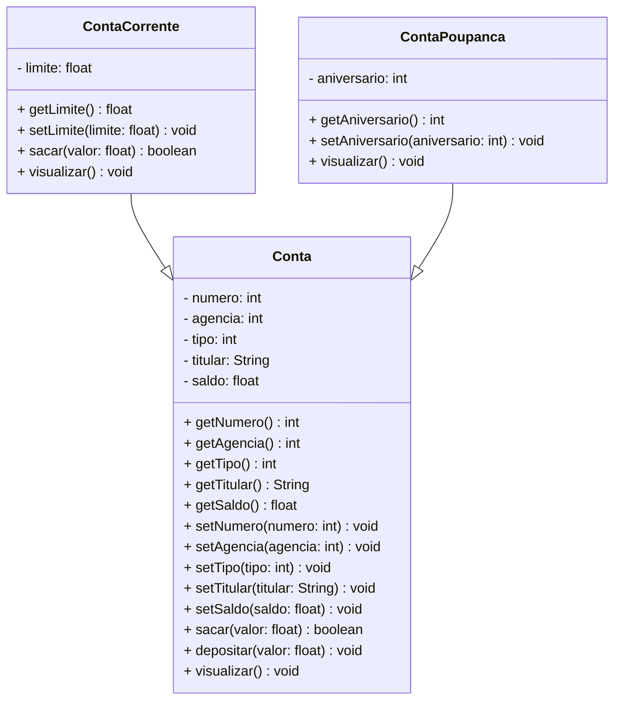

# Projeto Conta Bancária - Java

<div align="center">


</div>

---

## 1. Descrição

O **Projeto Conta Bancária** é um sistema de gestão projetado para simular e administrar operações financeiras relacionadas a contas bancárias. Oferece funcionalidades como **cadastro**, **consulta**, **atualização** e **remoção** de contas, além de transações como depósitos, saques e transferências.

O sistema organiza as informações dos clientes — incluindo nome do titular, número da conta, saldo e tipo de conta — garantindo a realização segura das operações. Seu principal objetivo é automatizar e simplificar o gerenciamento de contas bancárias, como Conta Corrente e Conta Poupança, promovendo agilidade e precisão no controle financeiro.

Este projeto, desenvolvido em **Java**, foca no estudo e aplicação dos conceitos de **Programação Orientada a Objetos (POO)**, incluindo:

- Classes e Objetos
- Atributos e Métodos
- Modificadores de Acesso
- Herança e Polimorfismo
- Classes Abstratas
- Interfaces

Além de servir como um simulador funcional, o projeto oferece uma base prática para compreender os princípios fundamentais da POO aplicados a um cenário realista.

## 2. Funcionalidades do Projeto

1. **Criar Conta:** Cria uma nova conta bancária especificando nome do titular, número da agência, saldo inicial e propriedades específicas conforme o tipo da conta. O número da conta é gerado automaticamente.

2. **Listar todas as Contas:** Lista todas as contas cadastradas no sistema.

3. **Consultar uma Conta pelo número:** Encontra uma conta pelo número.

4. **Consultar uma Conta pelo titular:** Encontra uma ou mais contas associadas ao nome do titular.

5. **Editar Conta:** Permite atualizar os dados de uma conta existente a partir do número da conta.

6. **Excluir Conta:** Remove uma conta específica com base no número da conta.

7. **Sacar:** Realiza a retirada de um valor de uma conta, desde que o saldo seja suficiente.

8. **Depositar:** Adiciona um valor ao saldo de uma conta existente.

9. **Transferir:** Transfere um valor de uma conta para outra, respeitando os respectivos saldos e limites.

## 3. Diagrama de Classes

Um **Diagrama de Classes** é um modelo visual usado na programação orientada a objetos para representar a estrutura de um sistema. Ele exibe classes, atributos, métodos e os relacionamentos entre elas, como associações, heranças e dependências.

Esse diagrama ajuda a planejar e entender a arquitetura do sistema, mostrando como os componentes interagem e se conectam. É amplamente utilizado nas fases de design e documentação de projetos.

Abaixo, você confere o Diagrama de Classes do Projeto Conta Bancária:



## 4. Tela Inicial do Sistema - Menu

<div align="center">


</div>

## 5. Requisitos

Para executar o projeto localmente, você precisará de:

- Java JDK 21+
- Eclipse IDE ou Spring Tool Suite (STS)

## 6. Como Executar o Projeto no Eclipse/STS

### 6.1 Importando o Projeto

1. Clone o repositório:

```bash
git clone https://github.com/nayarabastos/conta_bancaria.git
```

2. Abra o Eclipse/STS e selecione seu Workspace.

3. Vá em **File → Import...**

4. Selecione **General → Existing Projects into Workspace**.

5. Clique em **Browse...** e escolha a pasta onde o projeto foi clonado.

6. O Eclipse reconhecerá automaticamente o projeto.

7. Marque o projeto e clique em **Finish**.

### 6.2 Executando o Projeto

1. No **Package Explorer**, localize o projeto.

2. Abra a classe **Menu**.

3. Clique no botão **Run**.

4. Se solicitado, escolha **Java Application**.

5. O menu será exibido no console.

## 7. Contribuição

Este repositório faz parte de um projeto educacional, mas contribuições são sempre bem-vindas.

Você pode:

- Abrir uma **Issue**;
- Enviar um **Pull Request**;
- Compartilhar o projeto com outros estudantes de Java.

## 8. Contato

Desenvolvido por **Nayara Bastos Porto**

GitHub: https://github.com/nayarabastos

Caso tenha dúvidas, sugestões ou queira contribuir, fique à vontade para abrir uma **Issue** ou entrar em contato pelo GitHub.
